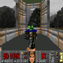
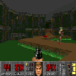
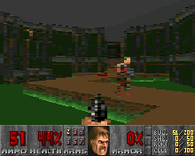
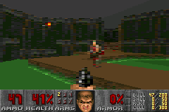
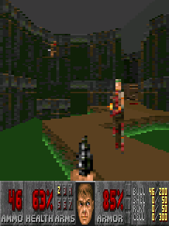

# P2kDoom8

A port of the **[Doom8088](https://github.com/FrenkelS/Doom8088)** engine by **[FrenkelS](https://github.com/FrenkelS)**, originally designed for old 16-bit DOS computers with [Intel 8088](https://en.wikipedia.org/wiki/Intel_8088) or [Intel 80286](https://en.wikipedia.org/wiki/Intel_80286) processors, to the Motorola P2K (Platform2000) platform. The **Doom8088** project is based on **[GBADoom](https://github.com/doomhack/GBADoom)**, a port of the **[PrBoom](https://doomwiki.org/wiki/PrBoom)** engine to the [Nintendo Game Boy Advance](https://en.wikipedia.org/wiki/Game_Boy_Advance) handheld gaming console. It is optimized for low-tier graphics and low-performance phones, such as the Motorola C380, C650, RAZR V3, E398, ROKR E1, and others.

// TODO: Video with Motorola C650?

Most GSM/P2K Motorola phones use the low-performance Neptune SoC, with its main MCU core being the ARM7TDMI-S @ 52 MHz. To enhance Neptune's port performance, the MCU core is typically overclocked to 65 MHz, and "hot path" compiled functions are moved from RAM to faster IRAM, located on the SoC die. Additionally, ELFs for the Neptune platform utilize hardware-accelerated rotozoom via the [ATI Imageon](https://en.wikipedia.org/wiki/Imageon) coprocessor when available; otherwise, they rely on DAL (Display Abstraction Layer), which binds to the display controller. More powerful UMTS/P2K phones are generally equipped with the Rainbow SoC, featuring an MCU core based on Motorola's unique pure-blooded RISC architecture, the [M·CORE](https://en.wikipedia.org/wiki/M%C2%B7CORE) M341S @ 90 MHz, or the Argon SoC with a fast MCU core based on the ARM1136JF-S @ 385 MHz architecture. These UMTS/P2K platforms use software rotozoom and hardware blitting through the [Nvidia GoForce](https://en.wikipedia.org/wiki/GoForce) or DAL, which also binds to the Nvidia GoForce driver. The primary P2K support code and ATI/Nvidia/DAL blitters are contained in the [P2K](Source/i_p2k.c) blitter. The [SDL1](Source/i_sdl1.c), [SDL2](Source/i_sdl2.c), and [SDL3](Source/i_sdl3.c) blitters were created to make development and debugging easier, supporting building on PCs and simplifying porting to other platforms.

## Screenshots

A collection of **P2kDoom8** screenshots taken from various Motorola phones. The E398, ROKR E1, and RAZR V3i utilize hardware rotation and scaling (rotozoom) via the ATI Imageon co-processor, while the others rely on software rotozooming (240x160 to final resolution) and use DAL or Nvidia drivers solely for blitting.

### Motorola C650 (128x128, SW rotozoom, DAL blitting)

   

### Motorola ROKR E1 (220x176, HW rotozoom, ATI blitting)

   

### Motorola E770v (176x220 and 220x176, SW rotozoom, Nvidia blitting)

   

   

### Motorola RAZR V3x (240x160, 240x320, and 320x240, SW rotozoom, Nvidia blitting)

   

   

 

 

## Photos

A collection of photos featuring various Motorola phones running the **P2kDoom8** port. Click on a photo thumbnail to enlarge it.

// TODO: Photos with C650, ROKR E1 or Motorola E398?, RAZR-like V3i?

## Files

The ready-to-run ELF builds can be downloaded from the [Releases](https://github.com/EXL/P2kDoom/releases) section on GitHub.

```
TODO: Tree with descriptions, or table.
```

## Install

The application uses the [ELF](https://en.wikipedia.org/wiki/Executable_and_Linkable_Format) format for distribution, requiring custom firmware with ElfLoader and ElfPack patches installed on the phone. Check out the [ELFs by EXL: Nostalgia for Developing on Motorola P2K](https://forum.motofan.ru/index.php?showtopic=1742337) thread on the MotoFan.Ru forum, where you can find instructions, awesome custom firmware, and more exciting ELF applications for Motorola phones!

The WAD file named `P2kDoom8.wad` should be placed in the same directory as the ELF application. On Rainbow and Argon platforms, you can use the `/e/mobile/P2kDoom8.wad` path to significantly optimize I/O performance in the game, thanks to the faster `/e/` disk on these devices.

## Keys and Controls

Description of the key controls in a schematic diagram and shortcut sheet. Click on the image thumbnail to enlarge it.

[](Media/Controls_P2kDoom8_C650_01.png)

### Controls

| Button                                                            | Description       |
| ----------------------------------------------------------------- | ----------------- |
| <kbd>LSK</kbd>                                                    | Quit              |
| <kbd>RSK</kbd>                                                    | Back, Open, Use   |
| <kbd>Up</kbd>, <kbd>Down</kbd>, <kbd>Left</kbd>, <kbd>Right</kbd> | Move              |
| <kbd>Center</kbd>                                                 | Select, Fire      |
| <kbd>Red/End/Power</kbd>                                          | Quit              |
| <kbd>1</kbd>                                                      | Escape, Main Menu |
| <kbd>2</kbd>, <kbd>4</kbd>, <kbd>6</kbd>, <kbd>8</kbd>            | Move              |
| <kbd>3</kbd>                                                      | Mod Key, Strafe   |
| <kbd>5</kbd>                                                      | Select, Fire      |
| <kbd>7</kbd>                                                      | Back, Open, Use   |
| <kbd>9</kbd>                                                      | Automap, Map      |
| <kbd>*</kbd>                                                      | Previous Weapon   |
| <kbd>0</kbd>                                                      | Fast Quit         |
| <kbd>#</kbd>                                                      | Next Weapon       |

### Cheats

Use the <kbd>3</kbd> button (Mod Key) pressed together with these keys:

| Button                                                            | Description       |
| ----------------------------------------------------------------- | ----------------- |
| <kbd>RSK</kbd>                                                    | Fun Rockets       |
| <kbd>1</kbd>                                                      | Show FPS          |
| <kbd>5</kbd>                                                      | God Mode          |
| <kbd>7</kbd>                                                      | Give All          |
| <kbd>9</kbd>                                                      | Chainsaw          |
| <kbd>Up</kbd>                                                     | End Level         |

## ELF Recipe

Please install the [P2K-ELF-SDK](https://github.com/MotoFanRu/P2K-ELF-SDK/) first to build all ELF files.

```sh
# Neptune
PHONE=E398 make -f Makefile.eg1
PHONE=C650 make -f Makefile.eg1

# Rainbow
RES=240x160 make -f Makefile.em2
RES=240x320 make -f Makefile.em2
RES=320x240 make -f Makefile.em2
RES=176x220 make -f Makefile.em2
RES=220x176 make -f Makefile.em2

# Argon
# TODO:
```

## WAD Recipe

Please download the ready-to-run WAD-creating tool from the [Releases](https://github.com/EXL/P2kDoom/releases) section on GitHub. The **jWadUtil** utility needs [Java](https://en.wikipedia.org/wiki/Java_(programming_language)) 21+ (JRE) to run and a JDK of the same version to build.

```sh
# Optionally.
# Download and install Java JDK 21+ if system JDK version is lower.
export PATH=/jdk-21.0.6/bin:$PATH
export JAVA_HOME=/jdk-21.0.6

# Execute commands from root of jWadUtil project directory.
cd jWadUtil

mvn package -DskipTests=true

# The "DOOM1_BE.WAD" file will be created.
java -jar target/jwadutil-1.0-SNAPSHOT.jar
```

## Revision

The [Source](Source) directory of the **[Doom8088](https://github.com/FrenkelS/Doom8088)** project was forked from the [`d16dca29e8d0d17920a32bac9e0f49878dad7fb7`](https://github.com/FrenkelS/Doom8088/commit/d16dca29e8d0d17920a32bac9e0f49878dad7fb7) revision.

## Authors and Thanks

- [Doom8088](https://github.com/FrenkelS/Doom8088)
- [GBADoom](https://github.com/doomhack/GBADoom)
- [PrBoom](https://doomwiki.org/wiki/PrBoom)
- [Linux Doom](https://doomwiki.org/wiki/Linux_Doom)
- [id Software](https://en.wikipedia.org/wiki/Id_Software)

---

*// EXL, 2025*
