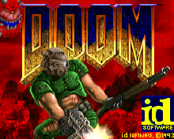
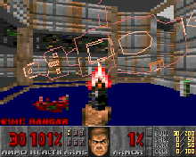
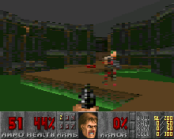

# P2kDoom

> [!IMPORTANT]
> This project is a work in progress (WIP) and is actively being developed.
>
> It is currently integrating changes from previous private repositories.

The legendary [Doom](https://en.wikipedia.org/wiki/Doom_(1993_video_game)) and [Doom II](https://en.wikipedia.org/wiki/Doom_II) games were ported to countless interesting and exotic platforms, but vintage Motorola mobile phones were overlooked by ports at the time. For nostalgic reasons, I decided to fix this unfortunate situation!

// TODO: Video

P2kDoom is an ambitious project focused on porting various [id Tech 1](https://en.wikipedia.org/wiki/Doom_engine) engines to vintage Motorola mobile phones running on the Motorola P2K (Platform2000) platform. This innovative platform, popular between 2000 and 2010, fostered a small but vibrant modding community scene in the 2000s. Enthusiasts developed unique Patches and ElfPacks with tons of ELF applications to enhance the functionality of these devices.

## Ports to P2K

The ports are implemented as ELF applications and require some custom firmware (Monster Pack) to run Doom on these devices.

### 1. [P2kDoom8](P2kDoom8)

  

A port of the **Doom8088** engine by **[FrenkelS](https://github.com/FrenkelS)**, originally designed for old 16-bit DOS computers with [Intel 8088](https://en.wikipedia.org/wiki/Intel_8088) or [Intel 80286](https://en.wikipedia.org/wiki/Intel_80286) processors. Optimized for low-tier graphics and low-performance phones, such as the Motorola C380, C650, RAZR V3, E398, ROKR E1, and others.

- **Original Sources**: 
  - [https://github.com/FrenkelS/Doom8088](https://github.com/FrenkelS/Doom8088)

### 2. [P2kDoomG](P2kDoomG)
A port of the **GBADoom** engine by **[doomhack](https://github.com/doomhack)**, originally developed for the [Nintendo Game Boy Advance](https://en.wikipedia.org/wiki/Game_Boy_Advance), with enhancements by **[Kippykip](https://github.com/Kippykip)** and **[FrenkelS](https://github.com/FrenkelS)**. Optimized for mid-tier graphics and moderate-performance phones, such as the Motorola E398, ROKR E1, RAZR V3i, RAZR V3x, E770v, and others.

- **Original Sources**:
  - [https://github.com/doomhack/GBADoom](https://github.com/doomhack/GBADoom)
  - [https://github.com/Kippykip/GBADoom](https://github.com/Kippykip/GBADoom)
  - [https://github.com/FrenkelS/GBADoomForDOS](https://github.com/FrenkelS/GBADoomForDOS)

### 3. [P2kDoomI](P2kDoomI)
A port of the **iDoom** engine by **hyarion** and **jobbe**, originally developed for the [Apple iPod](https://en.wikipedia.org/wiki/IPod). Designed for high-tier graphics and high-performance phones, such as the Motorola E770v, RAZR V3x, RAZR V3xx, KRZR K3, RAZR V6 maxx, FOMA M702iG, and others.

- **Original Sources**: 
  - [https://github.com/iPodLinux-Community/iDoom](https://github.com/iPodLinux-Community/iDoom)

## Geek Info

Motorola phones running the P2K platform typically used original, pure-blooded Motorola system-on-chips (SoCs) along with various mobile GPUs, including:

```
SoC: Neptune (alike), GSM/P2K
MCU: ARM7TDMI-S ARMv4 @ 52 MHz
DSP: S-OnyxU 56600S M56K @ 104 MHz
GPU: ATI Imageon W2250 @ 192 KB VRAM
RAM: 8 MB SDRAM

SoC: Rainbow (alike), UMTS/P2K
MCU: M·CORE M341S @ 90 MHz
DSP: StarCore SC140 M96K @ 145.1 MHz
GPU: Nvidia GoForce 4000 SC5 @ 640 KB VRAM
RAM: 32 MB SDRAM

SoC: Argon (alike), UMTS/P2K
MCU: ARM1136JF-S ARMv6 @ 385 MHz
DSP: StarCore SC140v3 M96K @ 208 MHz
GPU: Nvidia GoForce 4800 SC12 @ 1280 KB VRAM
RAM: 64 MB SDRAM
```

## Authors and Thanks

- [PrBoom](https://doomwiki.org/wiki/PrBoom)
- [Linux Doom](https://doomwiki.org/wiki/Linux_Doom)
- [id Software](https://en.wikipedia.org/wiki/Id_Software)

---

*// EXL, 2025*
